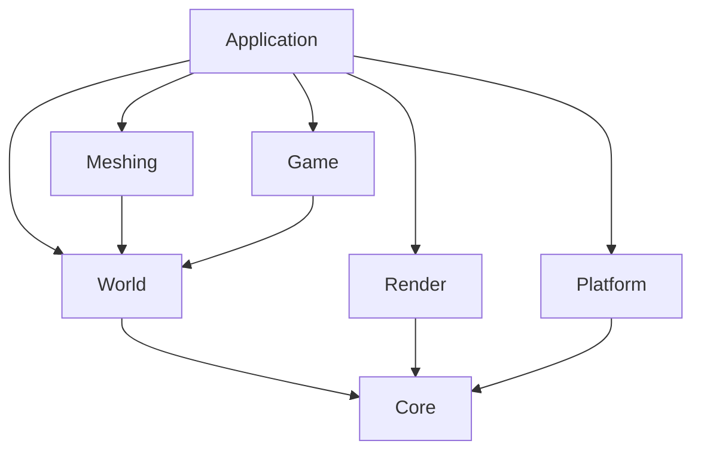

# VibeCraft

VibeCraft is a cross-platform voxel sandbox game inspired by Minecraft. The foundation stack is:

- `C++20`
- `SDL3` for windowing, input, timing, and platform integration
- `bgfx` for rendering abstraction across `Metal`, `Direct3D`, and other desktop backends
- `CMake` for builds on `Windows` and `macOS Apple Silicon`

## Read This First

Before starting any change:

1. Read this `README.md`.
2. Pull the latest remote changes.
3. Review the current module boundaries before adding code.
4. Keep the change focused and validate it locally.

Before pushing:

1. Build the project.
2. Run the tests for the touched systems.
3. Smoke-test launching the game.
4. Update this `README.md` if the structure or workflow changed.
5. Only push after explicit approval.

## Non-Negotiable Rules

- No source, header, config, or script file may exceed `800` lines.
- Keep the code modular. Prefer small classes and small translation units with one clear responsibility.
- Use object-oriented design for major subsystems and composition between systems.
- Do not let rendering code own gameplay state.
- Route world edits through commands or service methods instead of direct UI mutations.
- Keep platform code isolated from rendering code.
- Any architecture-affecting change must update this `README.md` in the same task.

## Project Goals

- Run natively on `Windows`.
- Run natively on `macOS` with Apple Silicon.
- Start with a desktop single-player prototype.
- Keep the architecture ready for co-op later without implementing networking yet.

## High-Level Architecture

The project is split into a few major layers:

- `app`: bootstraps the game and owns the main loop.
- `platform`: wraps SDL3 window creation, event polling, and OS-facing details.
- `render`: owns bgfx setup, frame submission, and renderer-facing debug output.
- `game`: camera and player-facing interaction logic.
- `world`: blocks, chunks, terrain generation, world state, save/load, and edit commands.
- `meshing`: converts voxel data into renderer-ready mesh data.
- `core`: logging and shared utilities.
- `tests`: focused validation for world logic and meshing.

The intended dependency direction is:



## Repository Layout

```text
.
|-- CMakeLists.txt
|-- CMakePresets.json
|-- README.md
|-- assets/
|   |-- saves/
|-- cmake/
|   |-- Dependencies.cmake
|-- include/
|   |-- vibecraft/
|       |-- app/
|       |-- core/
|       |-- game/
|       |-- meshing/
|       |-- platform/
|       |-- render/
|       |-- world/
|-- src/
|   |-- app/
|   |-- core/
|   |-- game/
|   |-- meshing/
|   |-- platform/
|   |-- render/
|   |-- world/
|-- tests/
```

## Module Responsibilities

### `app`

- Owns startup and shutdown order.
- Owns the per-frame update sequence.
- Pulls input from `platform`, applies it to `game`, updates `world`, then asks `render` to present a frame.

### `platform`

- Creates and destroys the SDL window.
- Polls SDL events and exposes a platform-neutral input snapshot to the app layer.
- Provides the native window handle needed by bgfx.

### `render`

- Initializes bgfx using the platform window.
- Owns frame lifecycle and resize handling.
- Must not own block data, player state, or terrain generation.

### `game`

- Owns camera state and high-level player interaction.
- Converts input intent into world-facing commands.

### `world`

- Owns chunks, block access, terrain generation, world persistence, and world edit commands.
- Should remain authoritative over world mutations.
- Must stay independent from renderer APIs.

### `meshing`

- Builds mesh data from chunks and world block queries.
- Produces data structures that render code can upload later.

### `core`

- Logging and small shared helpers only.
- Avoid turning `core` into a dumping ground.

## Current Vertical Slice Scope

The first runnable slice is intentionally small:

1. Create a desktop window.
2. Initialize `bgfx`.
3. Render a debug frame with game and world stats.
4. Support free-look camera movement.
5. Generate a small chunked terrain area.
6. Build CPU-side chunk mesh data.
7. Place and remove blocks through world edit commands.
8. Save and load the local world state.

This keeps the project moving while preserving good module boundaries for future chunk rendering, materials, lighting, and co-op.

## Collaboration Workflow

- Pull before starting work.
- Read `README.md` before starting work.
- Keep tasks narrow so conflicts stay manageable.
- Validate locally before asking for review or push approval.
- Update structure documentation when code structure changes.

## Recommended Work Split

To reduce merge conflicts, split work by module ownership instead of both people changing the same vertical slice at the same time.

### Person A: Core Architecture And Complex Systems

- Own `cmake/`, `CMakeLists.txt`, and `CMakePresets.json`.
- Own `src/platform/` and `include/vibecraft/platform/`.
- Own `src/render/` and `include/vibecraft/render/`.
- Own low-level `src/core/` and `include/vibecraft/core/`.
- Own `src/app/` and `include/vibecraft/app/`, because app integration is the highest-conflict area.
- Own all cross-module interfaces and any refactor that affects multiple subsystems.
- Own performance-sensitive or architecture-heavy work such as renderer upload flow, threading, chunk streaming, meshing pipeline integration, and future networking boundaries.
- Own platform validation on `macOS Apple Silicon` and later `Windows` build fixes.

### Person B: Feature Implementation Within Stable Interfaces

- Own feature work inside `src/world/`, `include/vibecraft/world/`, `src/meshing/`, `include/vibecraft/meshing/`, `src/game/`, and `include/vibecraft/game/` only when the interface is already agreed.
- Own gameplay-focused tests in `tests/` when they do not require shared integration changes.
- Own terrain tuning, block definitions, save/load extensions, gameplay rules, and content-side iteration built on top of Person A's interfaces.
- Avoid starting architecture refactors, shared integration changes, or build-system work without coordination first.

### Shared Integration Files

These files should be treated as shared and changed by only one person at a time:

- `README.md`
- `assets/`
- `tests/` when a test touches multiple owned modules

If one person is already working in a shared integration area, the other person should avoid changing it until that work is merged or explicitly coordinated first.

## Collaboration Rules

Use these rules for every task:

1. Read `README.md`.
2. Pull latest remote changes.
3. Announce which module or files you are taking.
4. Work in your owned area whenever possible.
5. If a task crosses module boundaries, agree on the interface first.
6. Validate locally before asking to merge or push.

## Cross-Module Handoff Pattern

When a feature touches both ownership areas, split it into two smaller changes:

1. Person A or Person B updates the interface contract first.
2. The other person builds against that contract in their own module.
3. One person does the final integration in `src/app/` if needed.

Example:

- Person A exposes new renderer or platform hooks.
- Person B uses those hooks from world, meshing, or gameplay code.
- Person A handles final integration in `src/app/Application.cpp` unless explicitly delegated.

## Merge Conflict Avoidance

- Do not work on the same file in parallel unless there is no other option.
- Keep branches focused on one task or one subsystem.
- Prefer adding new files over growing shared files.
- If a file starts becoming a shared hotspot, split it before it becomes a conflict magnet.
- Keep `README.md` updated when ownership, structure, or workflow changes.
- Avoid mixing refactors with feature work in the same branch.

## Suggested Short-Term Split

For the current foundation stage, the safest split is:

1. Person A handles `platform`, `render`, build tooling, app integration, and the most complex cross-module work.
2. Person B handles feature implementation inside `world`, `meshing`, and `game` after the interface and ownership boundaries are clear.
3. Person A keeps ownership of `src/app/Application.cpp` and other architectural hotspot files to reduce merge conflicts and avoid split responsibility in the hardest code.

## Validation Checklist

Run these steps for meaningful changes:

1. `cmake --preset default`
2. `cmake --build --preset debug`
3. `ctest --preset debug --output-on-failure`
4. Launch the built app and verify startup, camera movement, and block editing smoke-test correctly.

## Coding Guidelines

- Prefer explicit interfaces over hidden cross-module coupling.
- Prefer composition over inheritance unless inheritance is clearly the simpler model.
- Keep constructors lightweight.
- Keep headers focused and avoid leaking implementation details.
- Add short comments only where logic would otherwise be hard to parse quickly.
- If a file approaches `800` lines, split it before adding more behavior.

## Future Direction

When co-op is introduced later:

- Player input should stay separate from world mutation.
- World edits should remain command-driven.
- Chunks, players, and interactable objects should have stable identifiers.
- Serialization and networking should both depend on shared world data contracts instead of renderer state.
