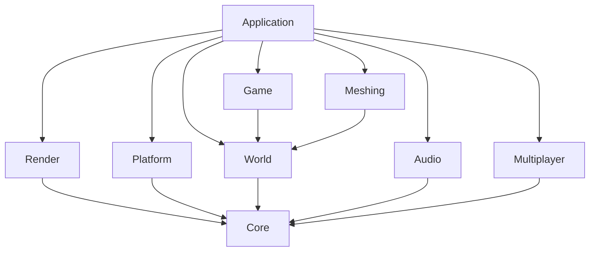

# VibeCraft

VibeCraft is a cross-platform voxel sandbox that is shifting from a general Minecraft-like prototype into a Mars terraforming survival game built around oxygen-limited exploration, safe-zone expansion, relay-grown habitats, and familiar tactile block gameplay.

The foundation stack is:

- `C++20`
- `SDL3` for windowing, input, timing, and platform integration
- `bgfx` for rendering abstraction across `Metal`, `Direct3D`, and other desktop backends
- `CMake` for builds on `Windows` and `macOS Apple Silicon`

## Read This First

Before starting any change:

1. Read this `README.md`.
2. Review the current module boundaries before adding code.
3. Keep the change focused and validate it locally.
4. Update this file in the same task if the architecture, workflow, or product direction changes.

Before pushing:

1. Build the project.
2. Run the tests for the touched systems.
3. Smoke-test launching the game.
4. Only push after explicit approval.

## Non-Negotiable Rules

- No source, header, config, or script file may exceed `800` lines.
- Do not let rendering code own gameplay state.
- Route world edits through commands or service methods instead of direct UI mutations.
- Keep platform code isolated from rendering code.
- Keep modules small and explicit instead of growing `Application.cpp` further.
- Preserve current movement, mining, placing, crafting, save/load, and multiplayer behavior unless a task explicitly changes them.

## Modular OOP and Extraction Rules

These rules are for all future contributors and should be treated as architecture policy, not suggestions:

- Every class and module must have one clear responsibility; if a file is handling unrelated concerns, split it.
- `Application` should orchestrate systems, not own every gameplay implementation detail.
- Prefer composition and service-style helpers over adding more static utility logic to monolithic files.
- New feature work should go into focused modules first; do not default to adding code into hotspot files.
- If a file crosses `700` lines, treat it as an extraction warning; if it reaches `800`, extraction is mandatory before adding more behavior.
- Extractions must preserve behavior and include local validation (build/tests/smoke checks) in the same change.
- Keep public interfaces small and explicit; move implementation detail to `.cpp` files and dedicated submodules.
- When extracting, place new code in existing domain folders (`app`, `game`, `world`, `render`, `audio`, etc.) before creating new structure.

## Game Vision

The target game keeps the current first-person voxel feel while changing the survival fantasy:

- Movement, block mining, placing, crafting, inventory, dropped items, and chunk-based world interaction remain core.
- The player explores a hostile Mars-like world with a limited oxygen supply.
- Bases become functional survival anchors because oxygen generators create safe zones that can slowly restore nearby terrain.
- Biomes matter mechanically through oxygen pressure, resource distribution, expedition planning, and where terraforming can spread next.
- Multiplayer remains supported in the codebase and should not be broken during the pivot.

The core question of the game is no longer "what do I want to build next?" by itself. It becomes "how far can I safely expand into a hostile world?"

## Core Pillars

- Familiar voxel interaction: mining, placing, crafting, building, and exploration should still feel immediately readable and satisfying.
- Oxygen survival: oxygen should add pressure early, become manageable mid-game, and support large-scale expansion later.
- Safe-zone expansion: a base is more than storage and crafting; it is breathable territory and the seed of a future habitat.
- Local terraforming: relay bubbles should let the player visibly push Mars from red dust toward living ground.
- Biome-driven expeditions: each biome should change the risk, resources, and route-planning value of exploration.
- Incremental migration: keep the current engine, renderer, chunk streaming, and multiplayer path intact while the content and progression shift.

## Current Playable Scope

The current codebase already supports a substantial prototype:

- Desktop window creation and `bgfx` initialization
- Grounded Minecraft-like movement with sprint, sneak, jump, water behavior, collision, and step-up
- Chunked terrain generation, chunk meshing, streaming, and frustum-culled rendering
- Block mining, placing, inventory, dropped items, hotbar plus bag storage, and crafting menus
- Day/night, weather, player vitals, mob spawning, chest storage, single-player saves, and multiplayer host/client sessions

The near-term product pivot should preserve those mechanics while changing the world, progression, and survival rules around them.

## Product Direction

Short-term direction:

- Introduce a dedicated oxygen system instead of treating air only as drowning.
- Add oxygen-safe zones through generator gameplay.
- Let relay safe zones begin simple local terraforming using existing voxel blocks before adding larger planetary systems.
- Replace overworld-flavored biome and resource identity with Mars-focused content.
- Keep current movement and voxel interaction feel stable.
- Keep multiplayer availability intact even if the single-player oxygen loop is the main design focus.

Not in scope for the first pass:

- Airtight-room simulation
- Pipe networks
- Pressure simulation
- Realistic atmospheric chemistry
- Rewriting the renderer, chunk mesher, or streaming system
- Major multiplayer redesign

## Asset Policy

Temporary art direction should favor speed and consistency over perfect originality.

- Reuse existing project textures and icons where they already fit.
- For placeholder icons and UI art, prefer assets from [`mcasset.cloud`](https://mcasset.cloud/26.1/assets) and its subfolders, especially the `icons` tree.
- Keep imported placeholder assets clearly replaceable so custom art can land later without code churn.
- When changing files under `assets/textures/materials/`, keep atlas indices and build scripts in sync.

## High-Level Architecture

The project is split into these major layers:

- `app`: startup, shutdown, main loop, gameplay orchestration, menus, save/load coordination, and high-level system integration
- `platform`: SDL3 windowing, event polling, focus, resize, and OS-facing details
- `render`: bgfx lifecycle, chunk upload, shaders, GPU UI, weather visuals, and debug presentation
- `game`: camera, vitals, weather, day/night, mobs, collision helpers, and survival-oriented gameplay systems
- `world`: blocks, chunks, terrain generation, persistence, world edits, and authoritative voxel data
- `meshing`: conversion from world voxels to renderer-ready chunk mesh data
- `audio`: music, sound effects, runtime audio roots, and shared output
- `multiplayer`: protocol, sessions, transport, snapshots, and block-edit synchronization
- `core`: logging and small shared helpers
- `tests`: focused validation for world logic, saves, crafting (`tests/crafting/`), multiplayer protocol, and gameplay systems

The intended dependency direction is:



## Repository Layout

```text
.
|-- CMakeLists.txt
|-- CMakePresets.json
|-- README.md
|-- assets/
|   |-- audio/
|   |-- saves/
|   |-- shaders/
|   |-- textures/
|-- cmake/
|   |-- Dependencies.cmake
|-- include/
|   |-- vibecraft/
|       |-- app/
|       |   |-- crafting/
|       |-- audio/
|       |-- core/
|       |-- game/
|       |-- meshing/
|       |-- multiplayer/
|       |-- platform/
|       |-- render/
|       |-- world/
|           |-- underground/
|-- scripts/
|   |-- build_chunk_atlas.sh
|-- src/
|   |-- app/
|   |   |-- crafting/
|   |-- audio/
|   |-- core/
|   |-- game/
|   |-- meshing/
|   |-- multiplayer/
|   |-- platform/
|   |-- render/
|   |-- world/
|       |-- underground/
|-- tests/
|   |-- crafting/
|   |-- game/
|   |-- multiplayer/
|   |-- world/
```

## Module Responsibilities

### `app`

- Crafting grid matching, recipe data, and related helpers live under `include/vibecraft/app/crafting/` and `src/app/crafting/`.
- Owns startup and shutdown order.
- Owns the per-frame update sequence.
- Pulls input from `platform`, updates `game` and `world`, and asks `render` to present the frame.
- Coordinates save/load, menu state, inventory UI flow, dropped items, and world sync.
- Should orchestrate systems, not accumulate every gameplay rule directly inside `Application.cpp`.

### `platform`

- Creates and destroys the SDL window.
- Polls SDL events and exposes a platform-neutral input snapshot to the app layer.
- Handles focus-loss and pixel-size-change events for app-facing lifecycle control.
- Provides the native window handle needed by bgfx.

### `render`

- Initializes bgfx using the platform window.
- Owns frame lifecycle, resize handling, renderer-side scene resources, shader loading, and GPU UI presentation.
- Owns chunk atlas sampling and renderer-side weather or sky presentation.
- Must not own block data, terrain generation, oxygen logic, or player state.

### `game`

- Owns camera-facing gameplay systems and player survival rules.
- Hosts reusable gameplay helpers such as vitals, collision helpers, weather, day/night, mobs, and oxygen-oriented systems.
- Should expose clear data and rules that `app` can orchestrate without duplicating gameplay policy.

### `world`

- Owns chunks, block access, terrain generation, world persistence, and edit commands.
- Remains authoritative over world mutation.
- Should own biome and resource distribution for the alien planet pivot.
- Must stay independent from renderer APIs.

### `meshing`

- Builds mesh data from chunks and world block queries.
- Produces data structures that render code can upload later.
- Should remain agnostic to gameplay progression and survival state.

### `audio`

- Owns music playback, sound effects, and runtime audio asset location.
- Should remain reusable as survival feedback expands with oxygen warnings, safe-zone hum, and alien ambience.

### `multiplayer`

- Owns protocol contracts, transport, host/client sessions, and synchronization helpers.
- Must remain functional while single-player survival systems evolve.
- Should only absorb protocol changes when a gameplay feature truly requires synchronized data.

### `core`

- Logging and small shared helpers only.
- Avoid turning `core` into a dumping ground.

## Migration Roadmap

The current migration path is:

1. Rewrite docs and contracts for the alien-planet oxygen-survival direction.
2. Introduce a dedicated oxygen system and save scaffolding.
3. Add generator-driven safe zones and oxygen HUD feedback.
4. Let relay zones start healing nearby ground and enable habitat growth.
5. Replace overworld biome identity with Mars biome rules and player-grown life.
6. Retune progression around expeditions, oxygen refills, planting, and territorial expansion.
7. Revisit multiplayer only where the new survival state truly needs synchronization.

## Solo Workflow

- Keep tasks narrow and explicit.
- Prefer adding new files over growing hotspot files.
- If a file approaches `800` lines, split it before adding more behavior.
- Treat `src/app/Application.cpp`, `include/vibecraft/world/Block.hpp`, `include/vibecraft/world/BlockMetadata.hpp`, `include/vibecraft/render/Renderer.hpp`, and `README.md` as hotspot files that need deliberate changes.
- Preserve multiplayer compatibility when changing saves, block enums, player state, or world serialization.

## Validation Checklist

Run these steps for meaningful changes:

1. After adding or changing files under `assets/textures/materials/`, rebuild the atlases with `scripts/build_chunk_atlas.sh` if tile layout changed.
2. `cmake --preset default`
3. `cmake --build --preset debug`
4. `ctest --preset debug --output-on-failure`
5. Launch `build/default/bin/vibecraft` and verify startup, movement, focus-loss mouse release, world loading, mining, placing, and menus still work.

Windows host validation:

1. `cmake --preset windows-debug`
2. `cmake --build --preset windows-debug`
3. `ctest --preset windows-debug --output-on-failure`
4. Launch `build/windows-debug/bin/vibecraft.exe` and verify the same core loop.

## Coding Guidelines

- Prefer explicit interfaces over hidden cross-module coupling.
- Prefer composition over inheritance unless inheritance is clearly simpler.
- Keep constructors lightweight.
- Keep headers focused and avoid leaking implementation details.
- Add short comments only where logic would otherwise be hard to parse quickly.
- Split hotspots before they become conflict magnets.

## Future Direction

Near-term:

- stabilize the oxygen survival loop
- shift world content toward a readable Mars terraforming identity
- keep the current tactile block gameplay intact
- preserve multiplayer support while avoiding unnecessary networking churn

Long-term:

- expand safe-zone and outpost gameplay
- deepen biome specialization and expedition progression
- replace temporary imported placeholder assets with original art
- extend multiplayer once the new survival contracts are stable
