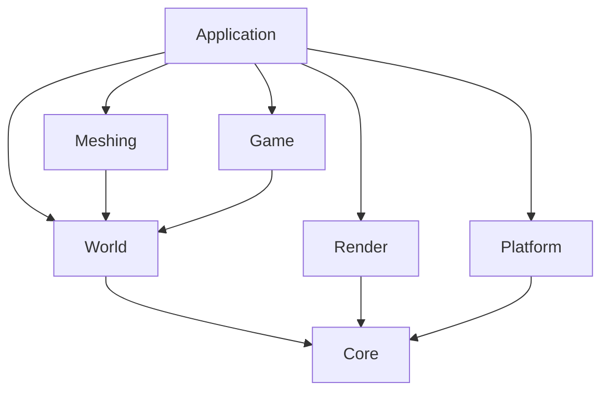

# VibeCraft

VibeCraft is a cross-platform voxel sandbox game inspired by Minecraft. The foundation stack is:

- `C++20`
- `SDL3` for windowing, input, timing, and platform integration
- `bgfx` for rendering abstraction across `Metal`, `Direct3D`, and other desktop backends
- `CMake` for builds on `Windows` and `macOS Apple Silicon`

## Read This First

Before starting any change:

1. Read this `README.md`.
2. Pull the latest remote changes.
3. Review the current module boundaries before adding code.
4. Keep the change focused and validate it locally.

Before pushing:

1. Build the project.
2. Run the tests for the touched systems.
3. Smoke-test launching the game.
4. Update this `README.md` if the structure or workflow changed.
5. Only push after explicit approval.

## Non-Negotiable Rules

- No source, header, config, or script file may exceed `800` lines.
- Keep the code modular. Prefer small classes and small translation units with one clear responsibility.
- Use object-oriented design for major subsystems and composition between systems.
- Do not let rendering code own gameplay state.
- Route world edits through commands or service methods instead of direct UI mutations.
- Keep platform code isolated from rendering code.
- Any architecture-affecting change must update this `README.md` in the same task.

## Project Goals

- Run natively on `Windows`.
- Run natively on `macOS` with Apple Silicon.
- Start with a desktop single-player prototype.
- Keep the architecture ready for co-op later without implementing networking yet.

## High-Level Architecture

The project is split into a few major layers:

- `app`: bootstraps the game and owns the main loop.
- `platform`: wraps SDL3 window creation, event polling, and OS-facing details.
- `render`: owns bgfx setup, frame submission, and renderer-facing debug output.
- `game`: camera and player-facing interaction logic.
- `world`: blocks, chunks, terrain generation, world state, save/load, and edit commands.
- `meshing`: converts voxel data into renderer-ready mesh data.
- `core`: logging and shared utilities.
- `tests`: focused validation for world logic and meshing.

The intended dependency direction is:



## Repository Layout

```text
.
|-- CMakeLists.txt
|-- CMakePresets.json
|-- README.md
|-- assets/
|   |-- shaders/
|   |-- saves/
|   |-- textures/
|-- scripts/
|   |-- build_chunk_atlas.sh
|-- cmake/
|   |-- Dependencies.cmake
|-- include/
|   |-- vibecraft/
|       |-- app/
|       |-- core/
|       |-- game/
|       |-- meshing/
|       |-- platform/
|       |-- render/
|       |-- world/
|           |-- underground/
|-- src/
|   |-- app/
|   |-- core/
|   |-- game/
|   |-- meshing/
|   |-- platform/
|   |-- render/
|   |-- world/
|       |-- underground/
|-- tests/
```

## Module Responsibilities

### `app`

- Owns startup and shutdown order.
- Owns the per-frame update sequence.
- Pulls input from `platform`, applies it to `game`, updates `world`, then asks `render` to present a frame.
- Rebuilds and submits prepared scene mesh data to `render` only for dirty chunks when world data changes.
- Maintains a camera-centered active chunk set so only nearby chunk meshes stay resident on the GPU.

### `platform`

- Creates and destroys the SDL window.
- Polls SDL events and exposes a platform-neutral input snapshot to the app layer.
- Handles focus-loss and pixel-size-change events for app-facing lifecycle control.
- Provides the native window handle needed by bgfx.

### `render`

- Initializes bgfx using the platform window.
- Owns frame lifecycle and resize handling.
- Owns renderer-side scene resources created from app-submitted mesh data.
- Owns the project shader pipeline under `assets/shaders/`.
- Owns the runtime chunk material atlas under `assets/textures/`.
- Updates GPU chunk resources incrementally instead of replacing the full scene on every world edit.
- Culls chunk draw calls against the camera frustum before submission.
- Uses a lighting-ready chunk vertex format with normals for basic directional shading.
- Loads `textures/chunk_atlas.bgra` (see `include/vibecraft/ChunkAtlasLayout.hpp`); dimensions must match `ChunkMesher` UV math.
- Debug HUD: `FrameDebugData` carries a **9×3 bag** slot grid (wider cells than the hotbar) plus a title line and item totals, drawn above the hotbar when the debug text buffer is tall enough.
- Must not own block data, player state, or terrain generation.

### `game`

- Owns camera state and high-level player interaction.
- Converts input intent into world-facing commands.

### `world`

- Owns chunks, block access, terrain generation, world persistence, and world edit commands.
- Should remain authoritative over world mutations.
- Must stay independent from renderer APIs.
- **Vertical scale (Minecraft reference):** `WorldVerticalScale.hpp` documents Java Edition 1.18+ overworld bedrock at **Y=-64..-60** (five layers; see [Bedrock](https://minecraft.wiki/w/Bedrock)) and maps that **layer count** onto VibeCraft’s shorter column (`Y=0..63`), where **`Y=0..4`** is the unbreakable bedrock shell. Generation stays modular: shared 2D noise in `TerrainNoise.hpp`; caves and cave fluids (water tables, rare lava pools) in `underground/CaveRules.*`; depth-biased ore veins (coal, iron, gold, diamond, emerald) in `underground/OreVeinRules.*`; `TerrainGenerator` orchestrates surface strata and delegates underground rules.

### `meshing`

- Builds mesh data from chunks and world block queries.
- Produces data structures that render code can upload later.

### `core`

- Logging and small shared helpers only.
- Avoid turning `core` into a dumping ground.

## Current Vertical Slice Scope

The first runnable slice is intentionally small:

1. Create a desktop window.
2. Initialize `bgfx`.
3. Render a debug frame with game and world stats.
4. Support free-look camera movement.
5. Generate a small chunked terrain area.
6. Build CPU-side chunk mesh data.
7. Place and remove blocks through world edit commands.
8. Save and load the local world state.

This keeps the project moving while preserving good module boundaries for future chunk rendering, materials, lighting, and co-op.

## Collaboration Workflow

- Pull before starting work.
- Read `README.md` before starting work.
- Keep tasks narrow so conflicts stay manageable.
- Validate locally before asking for review or push approval.
- Update structure documentation when code structure changes.

## Recommended Work Split

To reduce merge conflicts, split work by module ownership instead of both people changing the same vertical slice at the same time.

### Person A: Core Architecture And Complex Systems

- Own `cmake/`, `CMakeLists.txt`, and `CMakePresets.json`.
- Own `src/platform/` and `include/vibecraft/platform/`.
- Own `src/render/` and `include/vibecraft/render/`.
- Own low-level `src/core/` and `include/vibecraft/core/`.
- Own `src/app/` and `include/vibecraft/app/`, because app integration is the highest-conflict area.
- Own all cross-module interfaces and any refactor that affects multiple subsystems.
- Own performance-sensitive or architecture-heavy work such as renderer upload flow, threading, chunk streaming, meshing pipeline integration, and future networking boundaries.
- Own platform validation on `macOS Apple Silicon` and later `Windows` build fixes.

### Person B: Feature Implementation Within Stable Interfaces

- Own feature work inside `src/world/`, `include/vibecraft/world/`, `src/meshing/`, `include/vibecraft/meshing/`, `src/game/`, and `include/vibecraft/game/` only when the interface is already agreed.
- Own gameplay-focused tests in `tests/` when they do not require shared integration changes.
- Own terrain tuning, block definitions, save/load extensions, gameplay rules, and content-side iteration built on top of Person A's interfaces.
- Avoid starting architecture refactors, shared integration changes, or build-system work without coordination first.

### Shared Integration Files

These files should be treated as shared and changed by only one person at a time:

- `README.md`
- `assets/`
- `tests/` when a test touches multiple owned modules

If one person is already working in a shared integration area, the other person should avoid changing it until that work is merged or explicitly coordinated first.

## Collaboration Rules

Use these rules for every task:

1. Read `README.md`.
2. Pull latest remote changes.
3. Announce which module or files you are taking.
4. Work in your owned area whenever possible.
5. If a task crosses module boundaries, agree on the interface first.
6. Validate locally before asking to merge or push.

## Cross-Module Handoff Pattern

When a feature touches both ownership areas, split it into two smaller changes:

1. Person A or Person B updates the interface contract first.
2. The other person builds against that contract in their own module.
3. One person does the final integration in `src/app/` if needed.

Example:

- Person A exposes new renderer or platform hooks.
- Person B uses those hooks from world, meshing, or gameplay code.
- Person A handles final integration in `src/app/Application.cpp` unless explicitly delegated.

## Merge Conflict Avoidance

- Do not work on the same file in parallel unless there is no other option.
- Keep branches focused on one task or one subsystem.
- Prefer adding new files over growing shared files.
- If a file starts becoming a shared hotspot, split it before it becomes a conflict magnet.
- Keep `README.md` updated when ownership, structure, or workflow changes.
- Avoid mixing refactors with feature work in the same branch.

## Suggested Short-Term Split

For the current foundation stage, the safest split is:

1. Person A handles `platform`, `render`, build tooling, app integration, and the most complex cross-module work.
2. Person B handles feature implementation inside `world`, `meshing`, and `game` after the interface and ownership boundaries are clear.
3. Person A keeps ownership of `src/app/Application.cpp` and other architectural hotspot files to reduce merge conflicts and avoid split responsibility in the hardest code.

## Status And Next Steps

This section tracks what is already landed versus what each contributor should prioritize next. Update it when a milestone ships or the plan changes.

### Person A: recently completed

- `bgfx` chunk rendering with compiled shaders under `assets/shaders/` and CMake-driven `shaderc` builds.
- Incremental GPU chunk resources via `Renderer::updateSceneMeshes` instead of rebuilding the whole scene every edit.
- Camera-centered resident chunk meshing in `Application` so only nearby chunks stay uploaded.
- Frustum culling before submitting chunk draws.
- Chunk vertices with normals and basic directional lighting in the fragment shader; per-vertex normals computed in `Application` before upload.
- SDL3 focus and pixel-size handling; camera movement and mouse look gated on window focus.
- `World` exposes `dirtyChunkCoords()` for incremental app-side sync.
- Resident-only dirty mesh stat rebuilds: `Application` now asks `World` to rebuild just in-range dirty chunks, avoiding full dirty remeshing every frame.
- Streaming hitch reduction in `app`: missing chunk generation and resident chunk mesh builds now run with per-frame budgets and nearest-first prioritization, smoothing terrain pop-in while moving.
- Directional prefetch in `app`: chunk streaming now spends a dedicated budget on a forward look-ahead ring, reducing visible terrain pop when moving quickly.
- Budgeted off-resident dirty stat cleanup: `Application` now rebuilds only a small capped subset of off-resident dirty chunks per frame.
- Explicit sync staging in `Application`: CPU mesh generation and GPU upload/application are now separated into dedicated phases.
- Smoothed frame timing and FPS are now included in the renderer status line for quick performance checks.
- Added Windows-oriented CMake presets (`windows-debug` for configure/build/test) so Windows bring-up uses the same workflow as macOS.
- Renderer overlay now includes `bgfx` CPU/GPU frame times and draw/triangle counters for deeper graphics-side profiling.
- Textured chunk materials now use imported pixel-art assets under `assets/textures/`, with `ChunkMesher` emitting deterministic atlas UVs per block type instead of renderer-side planar projection.
- Grounded player controller in `app` (Minecraft-style): **1.8-block** standing hitbox (1.5 when sneaking), **Shift sneak** / **Ctrl sprint**, ~Java walking speed, gravity + jump, voxel collision, and **auto step-up** onto single-block ledges (no free-fly).
- First infinite terrain pass in `app`: the camera-centered streaming loop now asks `World` to generate missing chunks around the player beyond the resident render radius, so terrain extends as you move.
- Terrain generator now has layered deterministic noise and sea-level filling for more varied biomes and visible water regions.
- Inventory/bag expansion in `app`: mined blocks now flow through a 9-slot hotbar plus 27-slot bag with stack limits and hotbar auto-refill from bag; `1-9` selects the active hotbar slot.

### Person B: recently completed

- Procedural underground caves in `TerrainGenerator` using a density test that preserves the surface and shallow subsurface layers.
- Stratified underground content: **Deepslate** vs **Stone** by depth, **coal ore** placement, mesh colors, and tests for these features.
- Tests covering solid surface columns, air above terrain, cave presence in a sampled region, and save/load round-trip for edited blocks.
- Modular underground pipeline: **Minecraft 1.18+ bedrock layer count** mapped to `Y=0..4`, shared `TerrainNoise`, `underground/CaveRules` (water + rare **lava** pools), `underground/OreVeinRules` (**iron, gold, diamond, emerald** plus coal), new `BlockType` values and metadata tints.

### Next milestone priorities (agreed split)

These are the **next logical tasks** after the current vertical slice. Split keeps ownership clear and avoids merge fights.

**Person A should focus on**

1. **Infinite terrain generation (streaming):** extend the camera-centered loop so the world **generates and loads chunks as the player moves**, unloads or stops meshing far chunks within agreed budgets, and keeps GPU uploads stable. Person B defines *what* is in a chunk at `(chunkX, chunkZ)`; Person A owns *when* chunks exist, resident radius, and the `app` → `meshing` → `render` pipeline for scale.
2. **Inventory UI polish:** hotbar plus a large **9×3 bag panel** (title, totals, wide slots) in debug text; optional next step is true textured slots and drag/split interactions.
3. **Mining → pickup progression:** direct grant-on-break is in; optional later step is **item entities on the ground** and pickup when **walking onto/near** them for a more Minecraft-like feel.

**Person B should focus on**

1. **Sun / time-of-day (data + rules):** define a **sun direction** (and optionally a simple day cycle) as **world or game state** that rendering can read—so chunk lighting and future sky stay consistent. Person A applies it in shaders and debug UI once the value exists.
2. **Trees:** new block types if needed (e.g. log, leaves), **tree placement rules** in `TerrainGenerator` (or biome hooks), and tests. Meshing stays per-block `ChunkMesher` rules; coordinate with Person A before vertex layout changes.

**How this stays merge-safe:** Person B lands **content APIs** and **generation** (`world/`, `meshing/` data). Person A lands **streaming**, **inventory UI**, and **break → inventory** in `app`/`game`/`render` using `WorldEditCommand` / `blockAt` and agreed item types. Shared `README.md` updates one PR at a time.

### Person A: suggested next steps (Minecraft-like visuals + scale)

Ongoing work in parallel with the milestone above:

1. **Material expansion:** extend the imported atlas from the current per-block texture set to richer per-face rules (grass top vs side, dedicated ore variants, biome-driven swaps) without regressing the current UV contract.
2. **Sky and depth cues:** sky gradient and distance fog that match **Person B’s sun direction** once exposed.
3. **Occlusion and polish:** selection outline, optional AA after textures are stable.
4. **Windows bring-up:** run the `windows-debug` preset on a Windows host and fix shader output layout, runtime DLL copy, and path issues.

**How this stays merge-safe:** Person A owns the **GPU path** (`render/`, `assets/shaders/`, CMake shader build, and any new fields on `SceneMeshData` / renderer-facing structs). Person B owns **what gets meshed** (`meshing/`, block/tile tables in `world/`). For UVs, Person A lands the shader + vertex layout first; Person B fills `ChunkMesher` output to match—same handoff as `README` already describes, not two people editing `Application.cpp` in parallel.

### Person B: suggested next steps

1. **Sun and trees (milestone):** as in **Next milestone priorities** above—world-facing sun direction / day cycle hooks, then tree blocks and generation.
2. **Content and data:** additional `BlockType` values, biome hooks, and expanded **block → texture tile mapping** on top of the atlas + UV path that now exists.
3. **Meshing algorithms (CPU only):** greedy meshing, ambient occlusion baking—coordinate before changing vertex layout or adding attributes.
4. **Tests and saves:** new blocks, terrain edge cases, serializer changes as the world grows.
5. **Interface discipline:** any change to chunk vertex layout or GPU attributes is coordinated first; Person B does not own `render/` or final `app/` integration.

### Overlap watchlist (intentional touch points, not duplicate work)

| Topic | Person A | Person B |
| --- | --- | --- |
| Textures / UVs | Atlas loading, shader sampling, `SceneMeshData` layout, `fs_chunk` | Tile tables, which UVs each face emits in `ChunkMesher` |
| Infinite world | Resident radius, budgets, streaming loop in `app`, GPU upload | `TerrainGenerator` / chunk content at coordinates, save format for new chunks |
| Inventory / mining | Hotbar UI, break → grant item, `app`/`game` wiring | `BlockType` definitions, stack rules data if shared |
| Sun / sky | Shader sky, fog, sampling B’s sun direction | Sun angle, optional day cycle state |
| Trees | Rendering new block types once meshed | Log/leaves blocks, placement in terrain |
| Walking | Grounded controller, step-up, sneak/sprint in `app` (done) | Optional: swim / advanced movement in `game` |

If both need the same file in one sprint, use **two PRs in order**: contract/struct/shader first (A), then mesh/world data (B)—or the reverse if B only adds data and A adapts shaders after.

### Walking on the ground vs flying (when and who)

- **Grounded walking (current)** is implemented in `app` for normal playtesting: Minecraft-like bindings (sneak/sprint), step-up, jump, collisions. Free-fly should only be reintroduced as an optional debug mode if needed.
- Further movement tuning (swim, elytra-style flight, edge safety while sneaking) can move into **`game`** later; **`world`** stays authoritative for block queries.

### Infinite map / “Minecraft-like” streaming (who owns what)

- **Person B (`world`):** what a chunk *contains*—generation, biomes, caves, ores, serialization for chunks you have not visited yet, and rules for “generate chunk at coordinate.”
- **Person A (`app` + `render`):** how many chunks stay **loaded**, **meshed**, and **drawn**—resident radius, frame budgets, GPU upload queues, frustum and future LOD—so performance stays stable as the playable area grows.
- **Split the handoff:** Person B exposes a clear API like “ensure chunks in radius R exist” or “stream in chunk coords”; Person A calls it from the camera-centered loop and feeds `meshing` → `render`. That avoids two people editing the same streaming loop without a contract.

## Validation Checklist

Run these steps for meaningful changes:

1. After adding or changing files under `assets/textures/materials/`, rebuild the atlases: `scripts/build_chunk_atlas.sh` (requires ImageMagick `magick`). This keeps `chunk_atlas.png` / `chunk_atlas.bgra` in sync with `BlockMetadata` tile indices.
2. `cmake --preset default`
3. `cmake --build --preset debug`
4. `ctest --preset debug --output-on-failure`
5. Launch `build/default/bin/vibecraft` and verify startup, camera movement, focus-loss mouse release, and block editing smoke-test correctly.

Windows host validation:

1. `cmake --preset windows-debug`
2. `cmake --build --preset windows-debug`
3. `ctest --preset windows-debug --output-on-failure`
4. Launch `build/windows-debug/bin/vibecraft.exe` and verify startup, movement, and block editing.

## Coding Guidelines

- Prefer explicit interfaces over hidden cross-module coupling.
- Prefer composition over inheritance unless inheritance is clearly the simpler model.
- Keep constructors lightweight.
- Keep headers focused and avoid leaking implementation details.
- Add short comments only where logic would otherwise be hard to parse quickly.
- If a file approaches `800` lines, split it before adding more behavior.

## Future Direction

When co-op is introduced later:

- Player input should stay separate from world mutation.
- World edits should remain command-driven.
- Chunks, players, and interactable objects should have stable identifiers.
- Serialization and networking should both depend on shared world data contracts instead of renderer state.
